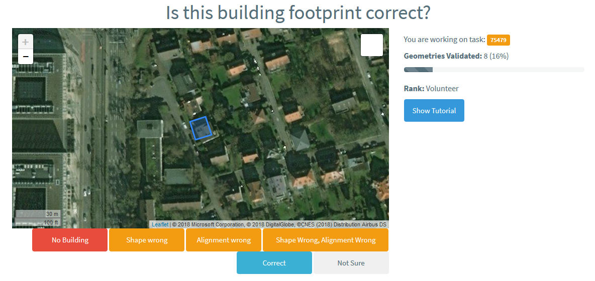

# Pybossa Prototype for MapSwipe 2.0
There is a [prototype project](https://pybossa.geog.uni-heidelberg.de/project/mapswipe_2_0/) in our pybossa instance. We will use this to test a building by building validation workflow.

It could look like this:




## Building Footprint Pre-Processing
A pre-processing step might be needed if the building dataset was generated automatically from satellite imagery. This pre-processing might include simplifying the geometries and making building polygons rectangular. There is already a [great document](https://docs.google.com/document/d/1DEGJYlR-92idDsaP7qICxXUcpC0PZ7ldP48fEmZgxPY/edit?usp=sharing) with information to consider during pre-processing.

* **[0.1 - Building Geometry Pre-Processing](0.1_building_geometry_pre_processing.ipynb)**: Simplify geometry and generate rectangular polygons, filter buildings already mapped in OSM.


[More information](https://www.dropbox.com/s/wtggt6jcv0w5pze/DigitalGlobe%20Building%20Footprints%20Technical%20Specification.pdf?dl=0) on the [Digital Globe Building Footprint Dataset](https://www.dropbox.com/s/zkh1gmw2i25u186/1104-tanzania-4326-20180403.zip?dl=0) can be found here. Furthermore, we set up a [Web Feature Service](http://mapswipe.heigit.org:8080/geoserver/web/wicket/bookmarkable/org.geoserver.web.demo.MapPreviewPage?1) where data can be downloaded for a bounding box. For example like this:

```bash
http://mapswipe.heigit.org:8080/geoserver/ms_layers/ows?service=WFS&version=1.0.0&request=GetFeature&typeName=ms_layers:tanzania_buildings_dg&maxFeatures=50&outputFormat=application%2Fjson
```


## Create Validation Tasks for Pybossa
To create tasks we need a polygon (e.g. for buildings) dataset (e.g. in GeoJSON format). Each polygon will represent a single crowdsourcing task. In pybossa a task has several default attributes and an "info" which is added for each task. The info attributes contains the information on the polygons such as geometry and an ID. A task object looks like this:

```json
{
"n_answer": 3,
"quorum": 0,
"calibration": 0,
"created": "2016-08-29T08:13:55.291284",
"state": "ongoing",
"project_id": 8,
"id": 18348,
"priority_0": 0,
"info": {
  "id": 123425435,
  "wkt_geom": "..."
  }
}
```

* **[1.1 - Create Task Presenter](1.1_create_task_presenter.ipynb)**: Create the html to visualize the mapping tasks.
* **[1.2 - Create Pybossa Tasks](1.2_create_pybossa_tasks.ipynb)**: Create tasks in Pybossa using a Geojson file containing polyongs (e.g. buildings).


## Get User Classifications and Aggregate Results
After a task was mapped by a sufficient number of volunteers (e.g. 3-5) the individual results will be aggregated (e.g. by considering the majority vote). If volunteers agree that a building is correct, this building could be directly uploaded to OSM.
* **[2.1 - Get User Classifications](2.1_get_user_classifications.ipynb)**: Download individual user classifications from pybossa
